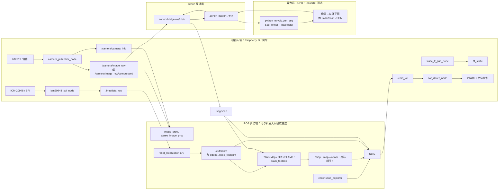
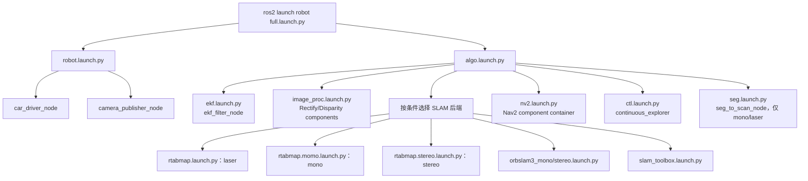
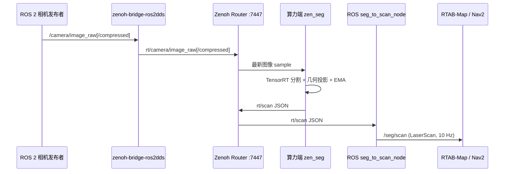

# Robot 子系统架构与部署说明

> **范围**：本文件只展开 `robot/` 相关链路，并明确区分“树莓派机器人端”“算力端”和“通信/基础设施端”。文中“当前实现”以仓库的 launch、节点和配置文件为准；“推荐部署”不等同于当前 Compose 已自动完成的部署。  
> **适用版本**：ROS 2 Jazzy、`robot` ament Python 包、Gazebo Harmonic 相关启动文件。

## 1. 先读结论

机器人系统由三类进程共同完成闭环：

| 部署位置 | 必须/可选程序 | 主要责任 | 与其他端的接口 |
|---|---|---|---|
| **机器人端（树莓派）** | `car_driver_node`、`camera_publisher_node`；按需启用 `icm20948_spi_node`、`static_tf_pub_node` | 接入相机、IMU、GPIO 底盘；执行 `/cmd_vel` | ROS 2 DDS：图像、IMU、TF、速度命令 |
| **机器人端或算力端（ROS 算法）** | `robot_localization` EKF、RTAB-Map/ORB-SLAM3/slam_toolbox、Nav2、探索节点 | 融合状态、建图、规划、输出 `/cmd_vel` | ROS 2 DDS；通常需要与机器人端共享 ROS domain/可发现网络 |
| **算力端（视觉推理）** | `python -m yolo.zen_seg`、SegFormer TensorRT engine | 分割图像、从像素几何投影得到伪激光 | Zenoh：订阅 `rt/camera/...`，发布 `rt/scan` |
| **通信基础设施** | Zenoh Router、`zenoh-bridge-ros2dds` | ROS 2 DDS 与 Zenoh 键空间互通 | `tcp/<router>:7447` 与 DDS 网络 |

当前 `docker-compose.yml` 将 `ros2` 和 `yolo` 作为 host-network 容器定义在同一主机，适用于单机联调；但代码中的 Zenoh 客户端固定连接 `tcp/127.0.0.1:7447`，Compose **没有**定义 Router 或 bridge 服务。因此，只启动 `docker compose up` 并不能保证图像与扫描会跨 DDS/Zenoh 传输：部署者还必须启动并配置 Router 与 `zenoh-bridge-ros2dds`，或将二者替换为等价通信方案。

## 2. 整体架构图

### 2.1 实车：控制、定位、感知和推理的全链路



**通行方式**：控制、相机、IMU、TF、EKF、地图和 Nav2 均是 ROS 2 topic/action/TF 流；分割推理为避免将模型依赖塞入 ROS 机器人容器，使用 Zenoh 键空间传输图像和扫描 JSON。`seg_to_scan_node` 在 ROS 端将 `rt/scan` 转换回 `sensor_msgs/LaserScan`。这种设计的关键是：DDS ↔ Zenoh 的桥必须双向工作，且图像/扫描时间戳必须在同一时基下可用。

### 2.2 ROS 2 进程局部架构



`full.launch.py` 本身只包含 `robot.launch.py` 和 `algo.launch.py`。真正启动哪些算法节点由 `sensor_mode` 与 `slam_backend` 的条件判断决定，不能把所有候选后端视作同时运行。

## 3. 机器人端：实际运行哪些程序

### 3.1 `robot.launch.py` 的当前行为

| 节点 | 当前是否在返回的 LaunchDescription 中 | 设备/输入 | 发布或执行 | 作用 |
|---|---:|---|---|---|
| `car_driver_node` | 是 | `cmd_vel` (`geometry_msgs/Twist`) | GPIO 电机/舵机 | 线速度正负控制四轮前进/后退；角速度设置转角；两者接近零时停车 |
| `camera_publisher_node` | 是 | 树莓派相机或视频文件 | 图像与 `CameraInfo` | 采集、JPEG 编码（可选）并发布相机标定 |
| `static_tf_pub_node` | **否（已定义但被注释）** | `robot_config.json` 中的 `tf_frames` | `/tf_static` | 发布底盘、IMU、相机之间的静态外参 |
| `icm20948_spi_node` | **否（已定义但被注释）** | SPI0/CE0 | `/imu/data_raw` | 读取 ICM-20948 加速度与角速度 |

这是实车落地最重要的现状：默认 `make ros2_robot` / `robot.launch.py` 并不发布仓库实现的静态 TF 或 IMU。若算法链依赖它们，应在启动命令中显式增加节点、取消相应注释，或确认已有其他设备驱动提供同名且语义一致的话题/TF。不要让两个节点重复发布同一 TF。

### 3.2 底盘执行局部架构

```text
Nav2 / teleop / 手工发布 Twist
             │  /cmd_vel
             ▼
      car_driver_node
       ├─ linear.x >  0.01 → FourWheelCar.forward(speed)
       ├─ linear.x < -0.01 → FourWheelCar.backward(abs(speed))
       ├─ |angular.z| > 0.01 → Steering.set_angle(angular.z)
       └─ 两者接近 0 → FourWheelCar.stop()
             │
             ▼
  GPIO：四组电机方向引脚 + BCM18 舵机转向
```

`FourWheelCar` 的电机引脚配置为 `(6,5)`、`(13,19)`、`(16,26)`、`(20,21)`，转向引脚为 BCM18。注意 `Twist.linear.x` 与 `angular.z` 被直接作为底盘类的速度/角度入参，代码未在节点层做显式单位转换、上限裁剪、命令超时或急停。因此实车必须先在悬空状态验证映射，并在运行系统外或节点中补充安全互锁和 watchdog。

### 3.3 相机与 IMU

| 组件 | 默认/硬编码参数 | 关键实现细节 | 联调检查 |
|---|---|---|---|
| 相机发布 | `camera_frequency=15.0` Hz、`compressed=True` | 压缩时发布 `/camera/image_raw/compressed`（JPEG）；否则发布 `/camera/image_raw`（`rgb8`）；两种模式都发布 `/camera/camera_info` | 模式必须与 RTAB-Map 的 `compressed` 参数、Zenoh bridge 映射一致 |
| 相机标定 | `config/imx219.json` | JSON 内参和畸变被映射为 `CameraInfo.K/D/R/P`；frame 为 `camera_link`（图像）和 `camera_optical_frame`（Info 模板） | 图像和 CameraInfo 的 frame/时间戳应统一后再供视觉算法使用 |
| ICM-20948 | SPI bus 0 / CE0、1 MHz、mode 0、100 Hz | WHO_AM_I 预期 `0xEA`；加速度换为 m/s²、角速度换为 rad/s；frame `imu_link` | 检查接线、静止重力方向、单位、时间戳和 `imu_link` 外参 |

### 3.4 机器人坐标系与几何配置

`config/robot_config.json` 是静态外参和伪激光投影共用的配置源，采用 REP-103（X 前、Y 左、Z 上；弧度制）：

```text
map
 └─ odom                         # 动态：SLAM / 定位架构决定
     └─ base_footprint           # 动态：EKF 发布
         └─ base_link            # 静态：z = 0.021 m
             ├─ imu_link         # 静态：z = 0.030 m
             └─ camera_link      # 静态：x = 0.100 m, z = 0.130 m, pitch = -0.1484 rad
                 └─ camera_link_optical  # 静态：roll = -π/2, yaw = -π/2
```

`static_tf_pub_node` 会跳过 parent 为 `odom` 或 `map` 的条目，避免静态发布动态坐标系。因而 `odom -> base_footprint` 的正确发布者应是 EKF，而不是 JSON 静态发布器。

## 4. 算法端：运行哪些组件、为何运行

### 4.1 编排参数与运行矩阵

入口为 `ros2 launch robot algo.launch.py`，或者由 `full.launch.py` 包含。启动参数的默认值是：

| 参数 | 默认值 | 可选值 | 影响 |
|---|---|---|---|
| `sensor_mode` | `stereo` | `mono`、`stereo`、`laser` | 决定图像处理、SLAM 订阅和是否启动伪激光 ROS bridge |
| `slam_backend` | `rtabmap` | `rtabmap`、`orbslam3`、`slam_toolbox` | 决定启动哪一个 SLAM launch |
| `compressed` | `true` | `true`、`false` | RTAB-Map 是否插入 `image_transport republish` 解压节点 |
| `use_sim_time` | `false` | `true`、`false` | 所有算法节点是否读取 `/clock` |

| 组合 | 自动包含的主要组件 | 主要输入 | 主要输出/用途 |
|---|---|---|---|
| `rtabmap + laser` | EKF、`seg_to_scan_node`、RTAB-Map laser、Nav2、探索、图像处理 | `/seg/scan`、`/ekf/odom`、IMU | 2D ICP 栅格地图与导航 |
| `rtabmap + mono` | EKF、伪激光 bridge、RTAB-Map mono、Nav2、探索、图像处理 | 单目图像、Info、里程计、扫描、IMU | 视觉建图与扫描增强 |
| `rtabmap + stereo` | EKF、RTAB-Map stereo、Nav2、探索、双目图像处理 | 左右图、左右 Info、里程计、IMU | 双目深度建图 |
| `orbslam3 + mono/stereo` | EKF、对应 ORB-SLAM3 launch、Nav2、探索；非 stereo 会启动伪激光 bridge | 外部 ORB-SLAM3 workspace 所需的相机/IMU | 视觉里程计/稀疏 SLAM 路径 |
| `slam_toolbox` | EKF、slam_toolbox、Nav2、探索；非 stereo 会启动伪激光 bridge | 应提供可用 2D scan 与 TF | 2D SLAM 对照路径 |

> `visual_odm_launch` 虽被定义，但当前没有放入 `algo.launch.py` 返回列表；不要假设 `/visual_odom` 会由该 launch 自动产生。EKF 配置仍订阅 `/visual_odom`，因此运行前应明确实际发布者，或调整 EKF 配置。

### 4.2 组件职责与关键接口

| 组件 | 实现/包 | 作用 | 核心接口 |
|---|---|---|---|
| 图像校正 | `image_proc::RectifyNode` | 根据 `CameraInfo` 去畸变，生成 rectified 图像 | `/camera/image_raw` → `/camera/image_rect` |
| 双目视差 | `stereo_image_proc::DisparityNode` | 近似同步左右目，计算视差 | 左右 rectified 图像/Info → disparity |
| 状态融合 | `robot_localization/ekf_node` | 以二维 EKF 融合轮速、视觉里程计和 IMU | 输入 `/wheel_odom`、`/visual_odom`、`/imu/data_raw`；输出 `/ekf/odom`、`odom→base_footprint` |
| 伪激光 ROS bridge | `seg_to_scan_node` | Zenoh JSON 扫描转 `LaserScan`，定时发布最新帧 | `rt/scan` → `/seg/scan` |
| SLAM | RTAB-Map / ORB-SLAM3 / slam_toolbox | 位姿估计、回环、地图构建（后端不同） | 图像/扫描/里程计/IMU → `/map`、位姿、相关 TF |
| 导航 | Nav2 composable nodes | 全局规划、局部控制、恢复行为与生命周期管理 | 地图、TF、odom、scan、目标 → `/cmd_vel` |
| 探索 | `continuous_explorer` | 向 Nav2 发探索目标 | Nav2 action/topic |

### 4.3 EKF 关键配置

`config/ekf.yaml` 配置 `frequency: 50.0`、`two_d_mode: true`、`world_frame: odom`、`base_link_frame: base_footprint`，并将 `/odometry/filtered` 重映射为 `/ekf/odom`。其观测选择如下：

- `/wheel_odom`：使用 `vx`、`vy`，相对模式开启；适用于仿真 Ackermann 插件或真实编码器驱动。
- `/visual_odom`：使用 `x`、`y` 与 yaw；配置为相对模式。
- `/imu/data_raw`：使用三轴角速度与 X/Y 线加速度，移除重力加速度。

因此，实车最小可运行条件不只是“有 IMU”：还需明确 `/wheel_odom`、`/visual_odom` 的实际来源、协方差、frame_id、时间戳和 TF 关系。若某一来源不存在，应将其从 EKF 配置中移除或以同一语义的节点替代，避免频繁 timeout 或融合错误。

### 4.4 RTAB-Map 的三种模式

| 模式 launch | 数据特性 | 关键 RTAB-Map 取舍 | 关键参数 |
|---|---|---|---|
| `rtabmap.launch.py`（laser） | 伪/真实 `LaserScan` + 外部 odom + IMU | `subscribe_scan=true`，关闭 RGB/Depth，`Reg/Strategy=1` 使用 ICP，二维优化 | `Grid/CellSize=0.05` m、`Grid/RangeMax=3.0` m、`Icp/Iterations=50` |
| `rtabmap.momo.launch.py`（mono） | 单目图像 + Info + odom + 可选 scan/IMU | 同时依赖单目几何与外部状态；压缩模式先解压 | 输入默认 `/camera/image_raw`、`/camera/camera_info`、`/ekf/odom` |
| `rtabmap.stereo.launch.py`（stereo） | 左右图 + 相机信息 + 外部 odom + IMU | `subscribe_stereo=true`，以深度栅格建图，视觉配准 | 深度 0.3–3.0 m、栅格 0.05 m、`Rtabmap/DetectionRate=2` Hz |

RTAB-Map 三种 launch 都声明了可改写的话题和 frame 参数；应优先在 launch 命令或部署配置中覆写，不要修改源码硬编码。当前启动时携带 `--delete_db_on_start`，意味着每次启动会删除 RTAB-Map 数据库；若要保留建图结果，需要先调整该行为并建立地图保存/版本策略。

### 4.5 Nav2 与控制闭环

`nv2.launch.py` 创建名为 `nav2_container` 的隔离组件容器，并以 composition 模式包含 `nav2_bringup` 的 `navigation_launch.py`；同时启动 map saver 与其生命周期管理器。Nav2 参数文件默认为 `config/nav2_params.yaml`，双目模式由 `algo.launch.py` 传入 `nav2_params_stereo.yaml`。

闭环前需要同时满足：

```text
map（SLAM 或已加载地图）
 + odom → base_footprint（EKF）
 + base_* → camera/imu（静态 TF 或 robot_state_publisher）
 + /seg/scan 或其他 obstacle source
 + Nav2 生命周期均为 active
 = Nav2 才能安全地输出 /cmd_vel
```

运行 `make status` 可快速检查 Makefile 中列出的 Nav2 生命周期节点，但仍应以 `ros2 lifecycle get <node>`、TF 树和实际 topic 频率复核。

## 5. 算力端：视觉分割如何与机器人通信

### 5.1 算力程序和数据流

算力端主程序是 `python -m yolo.zen_seg`。该程序加载相机内参 `robot/config/imx219.json` 与外参 `robot/config/robot_config.json`，然后：

1. 连接 Zenoh `tcp/127.0.0.1:7447`，订阅 `rt/camera/image_raw` 和 `rt/camera/image_raw/compressed`。
2. 以 `skip_n=3` 只保留每三帧的一帧，避免推理积压；推理队列大小为 1，始终偏向最新帧。
3. 在独立线程加载 `SegFormerTRTDetector`，提取分割结果的地面接触像素点。
4. 按相机模型投影到车体平面；在 [-40°, +40°]、0.5° 间隔生成 161 个束，范围为 `range_min=camera_height/tan(camera_pitch)` 到 3 m。
5. 对每束取最近值，扩散相邻束并按 `scan_alpha=0.3` 做 EMA 平滑；将 JSON 发布为 `rt/scan`。
6. ROS 端 `seg_to_scan_node` 也连接 Router，订阅 `rt/scan` 并以 10 Hz 发布 `/seg/scan`。



### 5.2 端口、网络和部署选择

| 方案 | 适用场景 | 关键条件 |
|---|---|---|
| 单机容器 | 快速调试；ROS、Router、推理在同一主机 | `127.0.0.1:7447` 可达；host network 避免端口/DDS 隔离 |
| 树莓派采集 + GPU 主机推理 | 实车常见；将模型算力移出机器人 | 将两个程序中的 Router 地址改为 GPU 主机可达地址；Router 监听 LAN；配置 DDS bridge 路由与防火墙 |
| 树莓派本机推理 | 模型和 runtime 可在 ARM 上运行时 | 评估 TensorRT/模型架构兼容性、热设计、帧率和内存；不应假定 NVIDIA 容器能直接在 Pi 上工作 |

当前 Compose 中两服务均是 host network，`yolo` 使用 `guojingneo/tensor_engine:pi5` 镜像标签且声明 GPU reservation；而 `Dockerfile.segformer_trt` 的基础镜像为 NVIDIA TensorRT。镜像标签、目标 CPU 架构、GPU runtime 与实际硬件之间必须在部署时验证，不能仅依据文件名推断可运行性。

### 5.3 Zenoh/DDS 互通的责任划分

| 程序 | 应运行位置 | 责任 |
|---|---|---|
| Zenoh Router | 两端都可访问的主机 | 为 Zenoh 客户端提供 `:7447` endpoint 与路由 |
| `zenoh-bridge-ros2dds` | 能看见 ROS 2 DDS domain 的一端 | 将 ROS topic 映射为 `rt/...` 键并将需要的键映射回 ROS |
| `yolo.zen_seg` | 有模型运行条件的算力端 | 仅处理 Zenoh 图像/扫描，不直接创建 ROS 2 节点 |
| `seg_to_scan_node` | ROS 算法端 | 订阅 Zenoh JSON，恢复 ROS 标准 `LaserScan` |

桥接规则、Router 地址和 topic 命名是部署配置的一部分。建议以配置文件或环境变量替代当前代码中的 `127.0.0.1:7447`、`rt/camera/...`、`rt/scan` 固定值，并将连通性检查纳入启动前检查。

## 6. 仿真局部架构

`full.sim.launch.py` 不启动实车 `robot.launch.py`；它按传感器模式选择 `sim.launch.py` 或 `sim.stereo.launch.py`，再包含算法 launch。

```text
Gazebo world（需先由 make sim / gz sim 启动）
  └─ ros_gz_sim create：从 4wd_car(.stereo).urdf.xacro 生成机器人
      ├─ robot_state_publisher：发布机器人模型 TF
      └─ ros_gz_bridge parameter_bridge
          ├─ Gazebo → ROS：/clock、/imu/data_raw、相机、CameraInfo、/wheel_odom、/joint_states
          └─ ROS → Gazebo：/cmd_vel
                └─ EKF / SLAM / Nav2 复用算法链
```

仿真使用 `use_sim_time=true`，所以 `/clock` 是全部节点时间一致性的必要输入。单目/激光仿真桥接的相机话题为 `/camera/image_raw`、`/camera/camera_info`；双目仿真另桥接右目图像与信息。world 不由这两个 launch 自动拉起，需先单独启动 Gazebo，且 `create` 使用的 world 名称为 `default`，部署时要确认它与实际世界匹配。

## 7. 必需配置、关键参数和变更规则

| 文件 | 管理内容 | 修改时必须同步检查 |
|---|---|---|
| `config/robot_config.json` | REP-103 外参、相机高度/俯仰 | 静态 TF、伪激光投影、URDF 安装位姿是否一致 |
| `config/imx219.json` | 相机内参、畸变、分辨率 | 相机驱动实际输出分辨率、`CameraInfo`、算力端投影 |
| `config/ekf.yaml` | 融合源、二维模式、噪声和 frame | 每个 odom/IMU 的来源、协方差和时间同步 |
| `config/nav2_params*.yaml` | costmap、控制器、规划器、行为树 | 地图分辨率、机器人 footprint、scan 量程与速度约束 |
| `launch/algo.launch.py` | 模式选择和包含关系 | `sensor_mode`、`slam_backend`、压缩与仿真时间必须全链路一致 |
| `docker-compose.yml` | 容器镜像、设备/目录挂载、host network | Router/bridge 是否另行运行，GPU/架构与运行时是否匹配 |

建议的参数变更顺序：**先**校验相机标定与静态外参，**再**校验单话题帧率/TF/时间戳，**然后**调整 EKF，**最后**调整 SLAM 与 Nav2。跳过前置几何与时钟检查而直接调 Nav2 参数，通常无法解决定位或障碍物错误。

## 8. 启动模板与验收清单

### 8.1 实车（推荐按阶段）

```bash
# 1. 构建并加载 ROS 工作空间
make ros2_build
source install/setup.bash

# 2. 基础硬件：确认 robot.launch.py 当前只启动底盘和相机
ros2 launch robot robot.launch.py

# 3. 算法：示例为单目 RTAB-Map；按实际硬件改写参数
ros2 launch robot algo.launch.py sensor_mode:=mono slam_backend:=rtabmap compressed:=true

# 4. 算力端（需已启动/可达 Zenoh Router 与 DDS bridge）
python3 -m yolo.zen_seg --config robot/config/imx219.json
```

上述命令是组件启动模板，不会自动补上 `static_tf_pub_node`、`icm20948_spi_node`、`/wheel_odom`、`/visual_odom`、Router 或 bridge；上线前应按本文件第 3、4、5 节的责任表补齐。

### 8.2 每次启动的最小验收顺序

```bash
# DDS / 进程
ros2 node list
ros2 topic list -t

# 相机和 IMU
ros2 topic hz /camera/image_raw
ros2 topic echo /camera/camera_info --once
ros2 topic echo /imu/data_raw --once

# TF 和状态估计
ros2 run tf2_tools view_frames
ros2 topic hz /ekf/odom

# 视觉伪激光与导航
ros2 topic hz /seg/scan
ros2 topic echo /seg/scan --once
make status
```

验收标准不是“节点不报错”而是：话题类型正确、帧率接近预期、时间戳单调且同一时基、frame_id 可沿 TF 树连通、Nav2 lifecycle 为 active，且以低速/悬空方式确认 `/cmd_vel` 的真实底盘方向符合预期。

## 9. 已知缺口与优先整改项

1. **补齐默认实车传感器与 TF 启动**：决定并固化静态 TF、IMU、轮式里程计和视觉里程计的唯一发布者；使 `robot.launch.py`、EKF 配置和实际硬件一致。
2. **将 Zenoh 基础设施纳入部署**：为 Router 与 DDS bridge 添加可版本化的 Compose/配置/健康检查，取消端点硬编码，并为跨机部署添加网络说明。
3. **建立接口契约**：为 `/camera/*`、`/imu/data_raw`、`/wheel_odom`、`/visual_odom`、`/seg/scan`、`/ekf/odom`、`/cmd_vel` 固化消息类型、QoS、频率、frame、时间基准与责任人。
4. **建立底盘安全边界**：增加 `/cmd_vel` timeout、限速/限角、急停、独立 watchdog 和从导航到 GPIO 的实车验收用例。
5. **校准并度量伪激光**：采集 rosbag，对物理障碍物测量距离偏差、端到端延迟、漏检/误检；在 Nav2 costmap 中采用保守膨胀与速度限制。

完成以上项目后，系统才能从“多个可单独运行的实验节点”转变为“可部署、可观测、可安全验收的机器人闭环”。
